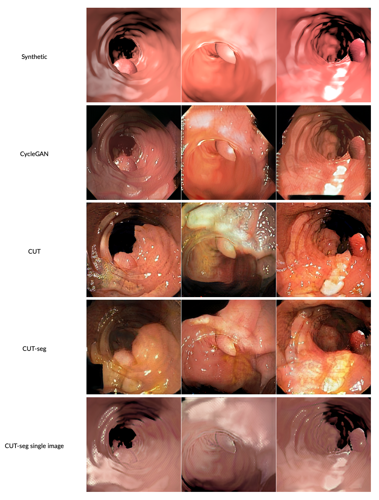

# Joint one-sided synthetic unpaired image translation and segmentation for colorectal cancer prevention

<p>
  
</p>

## Abstract
Deep learning has shown excellent performance in analysing medical images. However, datasets are difficult to obtain due privacy issues, standardization problems, and lack of annotations. We address these problems by producing realistic synthetic images using a combination of 3D technologies and generative adversarial networks. We propose CUT-seg, a joint training where a segmentation model and a generative model are jointly trained to produce realistic images while learning to segment polyps. We take advantage of recent one-sided translation models because they use significantly less memory, allowing us to add a segmentation model in the training loop. CUT-seg performs better, is computationally less expensive, and requires less real images than other memory-intensive image translation approaches that require two stage training. Promising results are achieved on five real polyp segmentation datasets using only one real image and zero real annotations. As a part of this study we release Synth-Colon, an entirely synthetic dataset that includes 20000 realistic colon images and additional details about depth and 3D geometry: [https://enric1994.github.io/synth-colon](https://enric1994.github.io/synth-colon/).

## Setup
* In order to run our code [Docker, Docker-Compose](https://gist.github.com/enric1994/3b5c20ddb2b4033c4498b92a71d909da) and [NVIDIA-Docker](https://github.com/NVIDIA/nvidia-docker) are required. 

* hardnet68.pth pre-trained weights for HarDNet68 can be found [here](https://github.com/PingoLH/Pytorch-HarDNet). Place it in the root folder.

* Required datasets can be found here: [train (402MB)](https://drive.google.com/file/d/1lODorfB33jbd-im-qrtUgWnZXxB94F55/view?usp=sharing), [test (327MB)](https://drive.google.com/file/d/1o8OfBvYE6K-EpDyvzsmMPndnUMwb540R/view?usp=sharing), [Synth-Colon (41GB)](https://enric1994.github.io/synth-colon/). Edit `docker/docker-compose.yml` with the location of your data. It should have the following structure: `polyp-data/{TrainDataset, TestDataset}`

* For consistency, rename all the `image` and `mask` folders in `TrainDataset` and `TestDataset` to `images` and `masks`.

## Training
1. Run `docker-compose up -d` in the `docker/` folder. It will start a container with all the dependencies installed.

2. Open the container CLI `docker exec -it cut bash`

3. Prepare datasets: `python /cut/data/prepare_datasets_finetuning.py`. This step will take around 10 minutes.

4. Train on the Kvasir dataset:

```
python train.py \
--dataroot /cut/datasets/finetune_Kvasir \
--name experiment_name \
--lr 0.00001 \
--batch_size 4 \
--n_epochs 50 \
--S_loss_weight 0.001
```

5. Test your best checkpoint on all datasets: `python test.py experiment_name`

## Logging
Images are saved in `checkpoints`. If you want to visualize the images and losses in Weights & Biases use the argument: `--wandb online`.

## References
* https://github.com/james128333/HarDNet-MSEG
* https://github.com/PingoLH/Pytorch-HarDNet
* https://github.com/taesungp/contrastive-unpaired-translation
